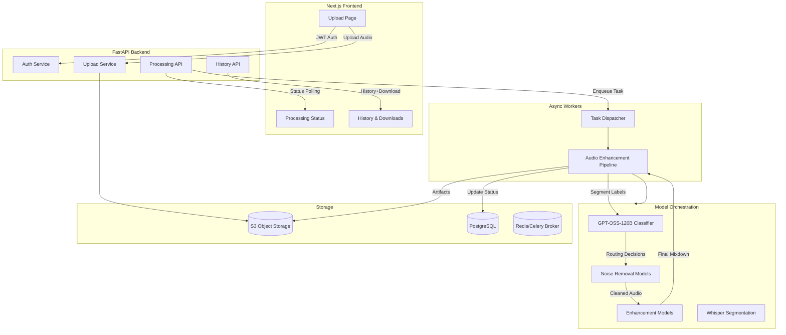

# Audai Katha Enhancement Platform

## Overview
Audai is an end-to-end application for enhancing Katha (spiritual discourse) recordings. The platform ingests raw audio, classifies segments with GPT-OSS-120B, routes them through targeted denoising and enhancement models, and delivers cleaned, spacious output while preserving harmonium and introductory vocals.

## System Architecture


## Processing Flow
1. **Upload & Auth** – Users authenticate via JWT. Audio files are uploaded through signed URLs directly to S3.
2. **Task Dispatch** – FastAPI enqueues a processing job with Celery; metadata is persisted in PostgreSQL.
3. **Segmentation & Classification** – Workers fetch audio, run Whisper for multilingual diarization, and feed features to GPT-OSS-120B for segment labels (speech, harmonium, secondary voices, noise).
4. **Targeted Enhancement** – Segments are routed through Hugging Face models:
   - `facebook/denoiser` and `speechbrain/sepformer-wham` for hum/hiss/noise.
   - `torch-audiomentations` presets for gentle reverb and EQ.
   - `suno/bark` style embeddings guiding harmonium enhancement.
5. **Voice Isolation** – Primary speaker is enhanced; secondary voices attenuated using spectral gating & diarization masks.
6. **Post-Processing** – Segments are recombined, LUFS-normalized, trimmed, and exported to MP3/WAV. History and metadata entries are updated.
7. **Delivery** – Frontend polls for completion, visualizes waveform deltas, and provides download & history pages.

## Repository Layout
```
frontend/
  app/
    layout.tsx
    page.tsx
    upload/page.tsx
    status/[jobId]/page.tsx
    history/page.tsx
    api/auth/route.ts
  components/
    UploadCard.tsx
    StatusTimeline.tsx
    WaveformPreview.tsx
  lib/
    api.ts
    auth.ts
  styles/
    globals.css
backend/
  app/
    main.py
    api/
      deps.py
      routes.py
      v1/
        auth.py
        jobs.py
        files.py
    core/
      config.py
      security.py
    models/
      user.py
      job.py
    schemas/
      auth.py
      job.py
    services/
      storage.py
      pipeline.py
      orchestrator.py
    workers/
      celery_app.py
      tasks.py
  pyproject.toml
  README.md
model_orchestration/
  prompts/
    gpt_oss_segment_classifier.md
  notebooks/
    exploration.ipynb
infrastructure/
  deployment.md
  terraform/
    main.tf
```

## Key Features
- Automatic harmonium-preserving enhancement pipeline driven by GPT-OSS-120B.
- Multilingual (English/Hindi/Gujarati) diarization, noise removal, and voice isolation.
- Frontend glassmorphism UI with waveform previews, progress indicators, and download history.
- Secure JWT auth, async processing queue, and cloud-native storage.

## Deployment Summary
1. Provision S3 bucket, PostgreSQL instance, Redis broker.
2. Deploy FastAPI backend to AWS ECS/Fargate or similar, pointing to cloud services.
3. Build Next.js frontend (static export or Vercel) with env vars for API base URLs.
4. Configure Celery workers with access to model weights; leverage Hugging Face cache in EFS.
5. Use Terraform scripts in `infrastructure/terraform` as a starting point for IaC.

Refer to individual component READMEs for setup and run instructions.
